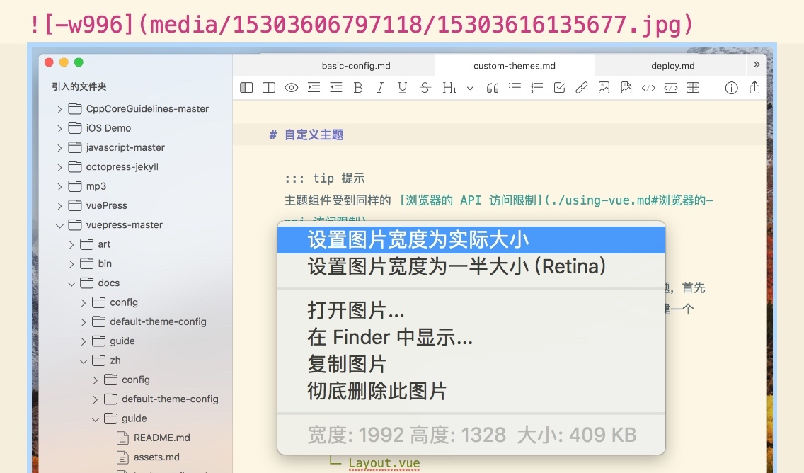

# Markdown辅助
##对插入图片的支持
请做以下尝试：

按下 Ctrl + CMD + Shift + 4 键，拖动然后截图，在 MWeb 中，按 CMD + V 键粘贴，即可插入图片。如果你要插入 PNG 格式的图片，可以使用菜单：编辑 - 粘贴为 PNG。
在浏览器（如：Safari）中，找到一张图片，然后 右键图片 - 复制图片，返回 MWeb，按 CMD + V 粘贴即可插入图片。
直接从 访达（Finder） 中拖拽图片到 MWeb 编辑器中插入图片。
在访达（Finder）中，找到一张图片文件，按下 CMD + C，返回 MWeb，按 CMD + V 即可插入。
使用工具栏上的插入图片按钮 （CMD + Option + I）。
你可以在 偏好设置 - 通用设置 中设置是否在编辑器中显示图片和是否把图片显示为缩略图。

##设置图片宽度及对齐
MWeb 引入的特别的语法来设置图片宽度，方法是在图片描述后加 -w + 图片宽度 即可，比如说要设置上面的图片的宽度为 140，语法如下：

在 MWeb 编辑器中，你也可以右键图片，然后选择一些对图片的操作，如下图：

在 MWeb 中，你还可以设置图片的对齐，以上面的图片为例子，左对齐为 -l140，居中为 -c140，居右为 -r140。

## MWeb 对插入表格的支持
你可以按工具栏上的插入表格按钮来插入表格，也可以用快捷键 Ctrl + Shift + T，如下图：

对于已存在的表格，你可以把光标移动到表格代码内，然后使用插入表格功能来修改已存在的表格。你可以先插入一张表格，然后再尝试修改。

## MWeb 对 LaTeX 书写的辅助
在 MWeb 编辑器中，光标移到 LaTeX 公式中间，即可以预览 LaTeX 公式，如果修改公式，预览也会实时更新，如下图：
块级公式：
$$ x = \dfrac{-bw \pm \sqrt{b^2 - 4ac}}{2a} $$

