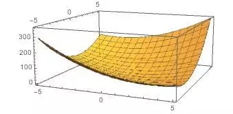
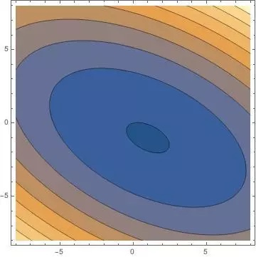
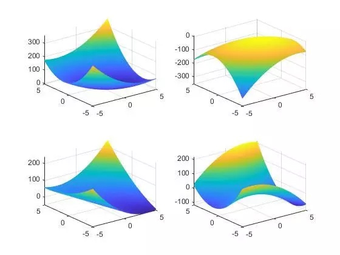

# 共轭梯度法
## 链接参考
https://blog.csdn.net/aiwodaqinshi/article/details/92835333

https://flat2010.github.io/2018/10/26/%E5%85%B1%E8%BD%AD%E6%A2%AF%E5%BA%A6%E6%B3%95%E9%80%9A%E4%BF%97%E8%AE%B2%E4%B9%89/

https://www.tinymind.cn/articles/4012

http://blog.sciencenet.cn/blog-54276-569356.html

https://www.codelast.com/%E5%8E%9F%E5%88%9B%E6%9C%80%E9%80%9F%E4%B8%8B%E9%99%8D%E6%B3%95%EF%BC%8C%E7%89%9B%E9%A1%BF%E6%B3%95%EF%BC%8C%E5%85%B1%E8%BD%AD%E6%96%B9%E5%90%91%E6%B3%95%EF%BC%8C%E5%85%B1%E8%BD%AD%E6%A2%AF%E5%BA%A6/

https://www.codelast.com/%e5%8e%9f%e5%88%9b-%e5%86%8d%e8%b0%88-%e5%85%b1%e8%bd%ad%e6%96%b9%e5%90%91%e6%b3%95conjugate-direction-method-in-optimization/

http://jacoxu.com/%E5%85%B1%E8%BD%AD%E6%A2%AF%E5%BA%A6%E6%B3%95/

https://www.jianshu.com/p/3ca4971a1a19

## 背景
共轭梯度法（Conjugate Gradient）是介于最速下降法与牛顿法之间的一个方法，它仅需利用一阶导数信息，但克服了最速下降法收敛慢的缺点，又避免了牛顿法需要存储和计算Hesse矩阵并求逆的缺点，共轭梯度法不仅是解决大型线性方程组最有用的方法之一，也是解大型非线性最优化最有效的算法之一。 在各种优化算法中，共轭梯度法是非常重要的一种。其优点是所需存储量小，具有步收敛性，稳定性高，而且不需要任何外来参数。

由于共轭梯度法不需要矩阵存储，且有较快的收敛速度和二次终止性等优点，现在共轭梯度法已经广泛地应用于实际问题中。共轭梯度法是一个典型的共轭方向法，它的每一个搜索方向是互相共轭的，而这些搜索方向d仅仅是负梯度方向与上一次迭代的搜索方向的组合，因此，存储量少，计算方便。

无处不在的线性方程组,昭示着一个优秀的算法能带来的巨大效益。对于简单的低阶方程组,只需要用普通的高斯消元法就能得到相当不错的结果,但是对于大型的方程组,常常与之相伴的就是稀疏性,如果还坚持使用高斯消元法,那么将带来的是空间上的巨大浪费。为此,迭代法求解方程组便应运而生。

共轭梯度法就是其中的佼佼者。

## 由来
###二次型的最小值
我们熟知的线性方程组,常常可以写成 $Ax=b$ 的形式,实际上当 $A$ 是实对称矩阵时,就是二次型$f(x)=\frac{1}{2} x^TAx-b^Tx+c$ 对 $x$ 的导数为 0 时的表达式。

$ f(x)  = \frac{1}{2} x^TAx-b^Tx+c $
$ f'(x) = \frac{1}{2} A^Tx+\frac{1}{2}Ax-b $

当 $A$ ​为实对称矩阵的时候, $f'(x)=0$ ​就等价于 $Ax=b$ ​.

而我们求解线性方程组的问题,也可以转化成求解 $minf(x) $

举个例子,当
$ 
A = \left( \begin{array}{ccc}3 & 2\\
     2 & 6 \end{array} \right),
b = \left( \begin{array}{ccc}2\\
     8 \end{array} \right),
c = 0
$
时, $f(x)$ ​的图如下

等高线图如下

看得出,此时的函数具有唯一的最小值。

由代数学的知识,我们知道,当矩阵$A​$为正定、半正定、负定、以及不定的时候,方程组$Ax=b$​具有不同的解的情况。对应$f‘(x)=0$​则是不同的最小值情况。

下面这幅图说明了矩阵A的性质对于$f(x)$的影响，依次是正定、负定、半正定和不定的情况。

可以看到,当$A$不定的时候,$f(x)$具有鞍点,这个时候无法通过导数为0来求得最值。

在接下来的共轭梯度方法中,我们都首先假定,A具有良好的性质,也就是对称和正定。

$\begin{aligned} % requires amsmath; align* for no eq. number
A & =(x-y)(x+y) \\
   & =x*x+x*y-y*x-y*y\\
   & = x^2 - y^2
\end{aligned}$

